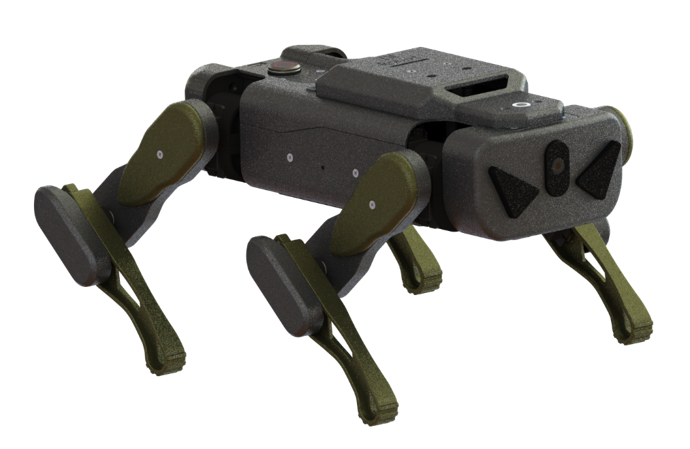

# [Quadruped]四足机器人图形编程软件包




---------------------------------------------------------

## 目录

* [相关链接](#相关链接)
* [描述](#描述)
* [积木列表](#积木列表)
* [许可证](#许可证)
* [支持列表](#支持列表)
* [更新记录](#更新记录)

## 相关链接
* 本项目加载链接 : ```https://gitee.com/eleven-ink/quadruped.git```

* 用户库教程链接 : ```https://mindplus.dfrobot.com.cn/extensions-user```


# 描述
-  本扩展库为maixduino扩展板设计，支持 Mind+ 导入库，要求 Mind+ 软件版本为 1.6.2 及以上。


# 积木


# 程序实例


# License
- MIT

# 支持列表

|主板型号|实时模式|ArduinoC|MicroPython|备注|
|-----|-----|:-----:|:-----:|-----|
|mpython|||√||


# 更新日志

V0.0.1 时间：2022/09/26  基础控制和运动完成